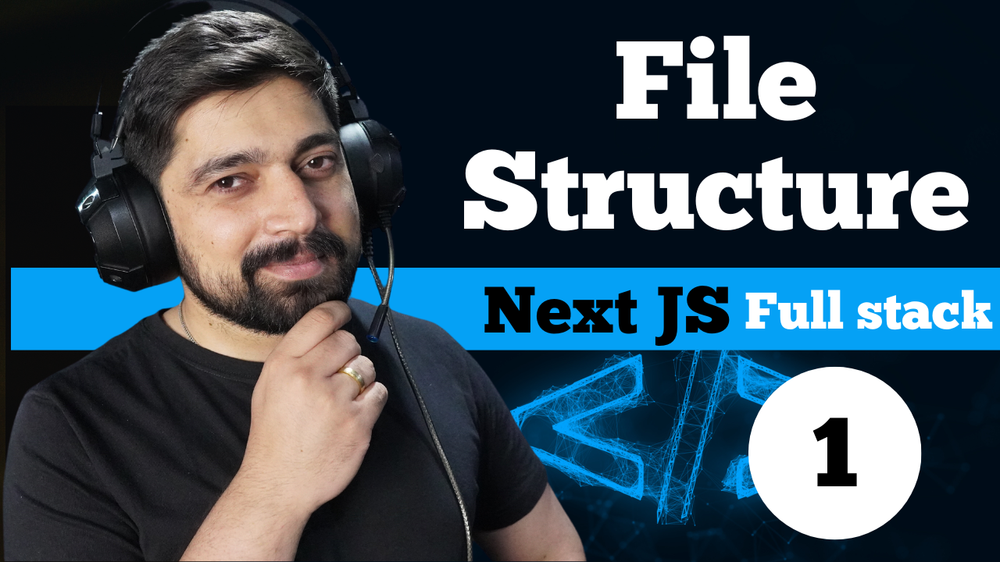

# A detailed course to undestand nextjs

This long video was designed to give you an indepth understanding about latest nextjs and how it works. 

## Tech Stack
- Nextjs
- typescript
- mongodb
- mailtrap



---
Available on my youtube channel
[Youtube channel link](https://www.youtube.com/@HiteshChoudharydotcom)

## Getting Started

First, run the development server:

```bash
npm run dev
# or
yarn dev
# or
pnpm dev
```
## Assignment
1. Improve the UI of the application
2. Add feature of forgot password

---
### Hint:
For forgot password feature.
1. User needs a page to enter his email and submit.
2. Validate if user exists, if yes, send him same token email that we discussed in this course
3. User clicks on email and get a page to enter new password with a submit button.
4. As soon as he click submit button, he is sending you a token and new password.
5. Verify the token and save the new password after encrypting it.

---
## your completed assignments

- Add your repo link here
- 